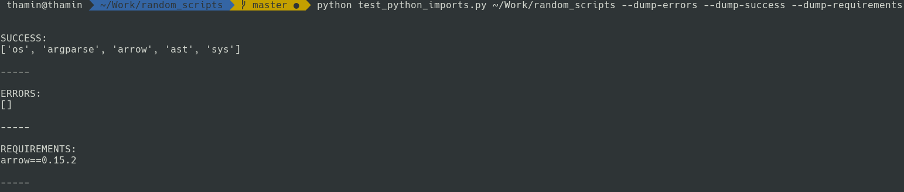
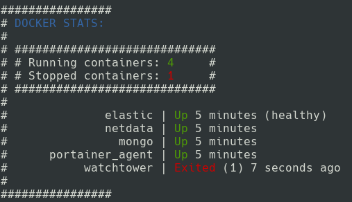
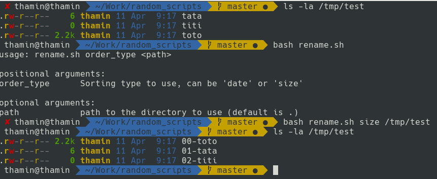
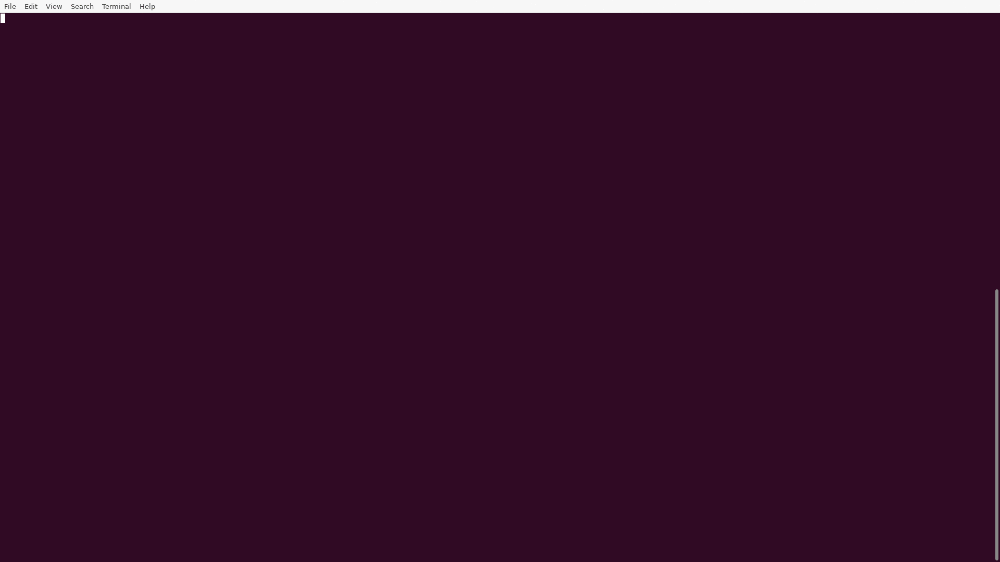
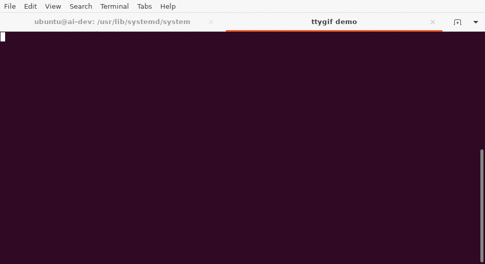
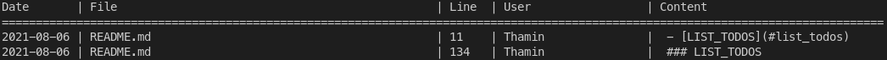

### Summary
- [Summary](#summary)
- [INTRODUCTION](#introduction)
- [TEST\_PYTHON\_IMPORTS](#test_python_imports)
- [20\_DOCKER\_STATS](#20_docker_stats)
- [RENAME](#rename)
- [EXEC\_TASK\_IN\_BG](#exec_task_in_bg)
- [EXEC\_TASKS\_IN\_BG](#exec_tasks_in_bg)
- [ANIMATE\_ASCII](#animate_ascii)
- [RANDOM\_MOUSE](#random_mouse)
- [LIST\_TODOS](#list_todos)
- [UNSPLASH2A](#unsplash2a)
____

### INTRODUCTION
_This repository contains various homemade scripts_
____

### TEST_PYTHON_IMPORTS
_This script is useful in big python projects when you want to check that all your imported modules are available in your environment_
- You can access the help by launching `python test_python_imports.py --help`:
```shell script
usage: test_python_imports.py [-h] [--dump-errors] [--dump-success] [--dump-requirements] path

positional arguments:
  path                 Path to the project directory you want to check

optional arguments:
  -h, --help           show this help message and exit
  --dump-errors        Dump list of unsuccessfully imported modules
  --dump-success       Dump list of successfully imported modules
  --dump-requirements  Dump successfully imported modules and their version (as in requirements files)
```
- Here is a basic example of output:

____

### 20_DOCKER_STATS
_this scripts add a docker stats paragraph to the MOTD of your UNIX system_
- You can test it with:
```shell script
bash 20-docker-stats
```
- If you want to add it to your MOTD:

```shell script
# Check you don't already have a file name `20-***` in `/etc/update-motd.d/`
ls -la /etc/update-motd.d/

# Add the bash script to your system MOTD folder
sudo cp ./20-docker-stats /etc/update-motd.d/
```
- Here is a basic example of output:

____

### RENAME
_this scripts renames all files in a directory by sorting them (by date or size) and adding a counter in front on them_
- You can access the help by launching `bash rename.sh`:
```shell script
usage: rename.sh order_type <path>

positional arguments:
order_type	Sorting type to use, can be 'date' or 'size'

optional arguments:
path		path to the directory to use (default is ".")
```
- Here is a basic example of use:

____

### EXEC_TASK_IN_BG
_this scripts runs a given command in background and displays a progressbar during its execution (based on the execution time)_
- You can access the help by launching `bash exec_task_in_bg.sh`:
```shell script
USAGE:
	bash exec_task_in_bg.sh [progress_bar_size] [expected_duration] [command]
EXAMPLE:
	bash exec_task_in_bg.sh 100 10 sleep 10
PARAMETERS:
	[progress_bar_size]	Size of the displayed progress bar (cannot be 0)
	[expected_duration]	Expected command duration in seconds (cannot be 0)
	[command]		Command to run in background
```
- Here is a basic example of use:

____

### EXEC_TASKS_IN_BG
_this scripts runs a given list of commands in background and displays a progressbar during their execution_
- You can access the help by launching `bash exec_tasks_in_bg.sh`:
```shell script
USAGE:
	bash exec_tasks_in_bg.sh [progress_bar_size] [tasks]
EXAMPLE:
	bash exec_tasks_in_bg.sh 100 'sleep 1' 'sleep 2' 'exit 1' 'sleep3'
PARAMETERS:
	[progress_bar_size]	Size of the displayed progress bar (cannot be 0)
	[tasks]		Commands to run in the background
```
- Here is a basic example of use:

____

### ANIMATE_ASCII
_this scripts animates one or many ascii arts from the top of the terminal to the bottom of the terminal_
- You can access the help by launching `bash animate_ascii.sh`:
```shell script
USAGE:
	bash animate_ascii.sh [name]
EXAMPLE:
	bash animate_ascii.sh 'asciiArts'
PARAMETERS:
	[name]		File or directory containing the ascii art(s)
```
- Here is a basic example of use:

____

### RANDOM_MOUSE
_this scripts randomly moves the mouse on the screen_
- You can access the help by launching `bash random_mouse.sh`:
```shell script
USAGE:
	bash random_mouse.sh [min_sleep] [max sleep]
EXAMPLE:
	bash random_mouse.sh 1 3600
PARAMETERS:
	[min_sleep]	Minimal sleep time between random moves (in seconds)
	[max_sleep]	Maximal sleep time between random moves (in seconds)
```
____

### LIST_TODOS
_this scripts list todos from the oldest to the newest in a given repository_
- You can use it by launching `bash list_todos.sh PATH_TO_YOUR_REPO`
- Here is a basic example of output:


____

### UNSPLASH2A
_this scripts displays random unsplash images as ascii art in your terminal_
- See detailed usage [detailed usage](unsplash2a/README.md)
- Here is a basic example of output:

