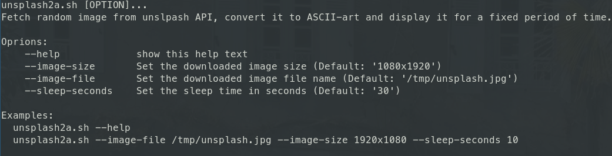

# Usage

- CLI helper: 

___

## With Docker
### Build docker image
``` bash
docker build . -t unsplash
```

### Launch docker container
``` bash
docker run -t --rm unsplash:latest
```

### Kill / Remove docker container
``` bash
docker kill $(docker ps | grep unsplash | cut -d " " -f 1)
```

___

## Without Docker
### Install requirements
``` bash
sudo apt install -y curl jp2a
```

### Launch script
``` bash
bash unsplash2a.sh
```
